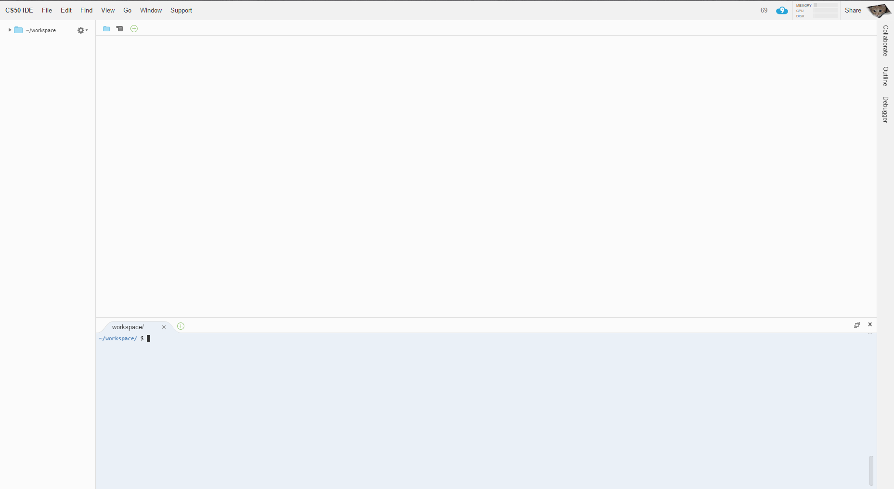

# Getting Started (CS50 IDE)

In deze cursus gaan we werken met een online ontwikkelomgeving. Je hoeft daarom niets te installeren op jouw laptop, en je kan vanaf elke computer verder werken. Om toegang te krijgen tot de ontwikkelomgeving vragen we je de volgende stappen af te werken:

1. Registreer bij edX op [https://courses.edx.org/register](https://courses.edx.org/register). 
2. Login met jouw net aangemaakte account op [https://cs50.io/](https://cs50.io/).

Na wat berichten en laadbalken over het opzetten van je workspace, zie je nu dit scherm in jouw browser:

Mocht je liever een wat donker scherm willen, ga dan naar het dropdown menu **view** -> **night mode**. Voel je ook vrij om nog een beetje te speuren door de dropdown menu's. Het is okee als je nog niet begrijpt wat alles betekent. Mocht je je wat comfortabeler voelen met deze cursus omdat je wat meer programmeer / computer skills hebt, of je bent gewoon nieuwsgierig, zet dan gerust eens **view** -> **Less Comfortable** uit voor nog meer opties.

Links bovenin zie je een folder icoontje met daarachter de tekst **~/workspace**. Rechtsklik of ctrl+klik hierop en selecteer vervolgens **New Folder**. Noem deze folder **week1**. 

Onderin het scherm zie je de terminal, een omgeving waarin je commando's kan uitvoeren. Voer maar eens het volgende commando uit:

    ls

Het commando `ls` is een afkorting van list. Dit commando "list" alle bestanden en folders van de huidige folder. Standaard begint de terminal in de folder `~/workspace`, en door het uitvoeren van het commando `ls` zie je nu ook enkel de folder `week1` die je net hebt aangemaakt. Laten we nu daarnaar bewegen door middel van het volgende commando:

    cd week1

Het commando `cd` is hier een afkorting van compact disc, uh, nee, change directory. Het verandert dus de huidige folder naar een andere folder, in dit geval `week1`. Zou je nu `ls` nog een keer uitvoeren, dan zijn er geen resultaten. Laten we hier verandering in brengen door middel van het volgende commando:

    touch print.py

Nu hebben we een bestand aangemaakt genaamd `print.py` binnen de folder `week1`. Om dit te controleren voer nog een `ls` uit. Het commando `touch` kijkt of een file (in dit geval `print.py`) bestaat, zo niet maakt het deze aan. 

Om de file `print.py` te openen, ga je naar links bovenin je scherm waar je een folder icoontje ziet gevolgd door de tekst **~/workspace**. Druk op het driehoekje ernaast om de folder `~/workspace` te laten uitklappen. Doe vervolgens hetzelfde bij de folder `week1`, en dubbelklik dan op de file `print.py`. Nu opent er een nieuw tabje genaamd `print.py` en ben je klaar om te beginnen met programmeren.

Handig om te weten is dat je via het commando `cd` een folder omhoog kan via:

    cd ..

Hier staat `..` voor de folder boven de huidige. Wil je er meer omhoog? Dan kan dat via `../..`. Ook kan je `cd` de instructie geven om niet relatief van de huidige folder te bewegen, maar absoluut ten opzichte van jouw login folder. Bijvoorbeeld:

    cd ~/workspace/week1

Brengt je meteen naar de `week1` folder binnen `workspace`. 

# Getting Started (matplotlib and checkpy)

We gebruiken een programma om te checken of je opdrachten op de juiste manier werken. We vragen je om heel precies te zijn in het geven van de juiste uitvoer. Dit programma dat we gebruiken heet `checkpy` en wordt niet standaard meegeleverd met de online ontwikkelomgeving. Daarnaast gaan we aan de slag met het plotten van grafieken, en hiervoor hebben we een Python module nodig genaamd `matplotlib`. Ook deze moeten we apart downloaden.

Om zowel `matplotlib` en `checkpy` te downloaden voer je in de terminal één voor één de volgende commando's uit:

	sudo sh -c "umask 022; pip2 install -U pip setuptools"
	sudo sh -c "umask 022; pip2 install matplotlib"
	sudo sh -c "umask 022; pip2 install checkpy"
	sudo sh -c "umask 022; checkpy -d https://github.com/Jelleas/progBG2017Tests"

Het kan best eventjes duren per commando, en er zal aardig wat tekst over je scherm ratelen. 

## checkpy

Checkpy gebruik je door in de terminal commando's uit te voeren. Als je zometeen de opdracht `hello.py` af hebt, kun je deze testen door middel van het volgende commando:

    checkpy hello

Het is hierbij wel belangrijk dat wanneer je dit commando uitvoert je je in de folder bevindt waar jouw opdracht `hello.py` zich bevindt. Ben je straks klaar met al het werk voor de week? Dan kun je al je bestanden in één keer testen door het volgende commando uit te voeren:

    checkpy -m module1

Dit *checkt* voor jou in één keer al jouw opdrachten van de eerste module. 

Let wel, checkpy is erg streng. Het is de bedoeling dat je zorgt dat je programma de check door komt. Mocht je niet begrijpen waarom je antwoord wordt afgekeurd, spreek dan meteen een assistent aan tijdens het practicum. We kijken dan met je mee.