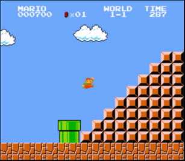

# Mario

## tl;dr
Implementeer een programma dat een halve piramide uitprint van een door de gebruiker gegeven hoogte.

```
Hoe hoog moet de pyramide zijn? 5
    ##
   ###
  ####
 #####
######

Hoe hoog moet de pyramide zijn? 3
  ##
 ###
####
```

## Background
Aan het einde van wereld 1-1 in Super Mario Brothers moet Mario een halve pyramide van blokken beklimmen voordat hij mag springen naar een vlaggenpost. Dit ziet er zo uit:



## Specification

* Schrijf in een bestand genaamd `mario.py` een programma dat de halve pyramide van Mario nabouwt door middel van hashes (`#`).
* Vraag eerst aan de gebruiker de hoogte van de halve piramide. Dit mag enkel een geheel positief getal zijn tussen 0 en 23. (0 en 23 wel, -1, 24 en 176 niet)
* Wanneer de gebruiker een foute hoogte invult vraag je de gebruiker opnieuw naar de hoogte. Net zo lang tot de gebruiker een goede hoogte invult.
* Je mag aannemen dat de gebruiker enkel komma getallen (floats) en gehele getallen (integers) invult.
* Als de hoogte bekend is, genereer dan door middel van `print` en één of meer loops de halve pyramide.
* Let goed op dat er geen spatie tussen de rand van je scherm en de onderste laag van je pyramide staat!

## Hints

* In Python kun je strings vermenigvuldigen door gehele getallen (integers). Probeer maar eens `"Hello" * 3`.
* Tel goed hoe veel spaties en hashes er op elke regel moeten staan.
* Denk goed na over welke loop structuur (`for` en `while`) je wilt gebruiken.
* Deel het probleem op in delen. Zorg bijvoorbeeld eerst dat de gebruiker een getal kan invoeren. Daarna kun je kijken of je kan voorkomen dat de gebruikers foutieve input geeft, en dan de pyramide zelf.
* Mocht de gebruiker een float invullen, dan wil je deze waarschijnlijk converteren naar een int. Je kan door middel van de functie `int` een float converteren naar een integer. Probeer maar eens `int(7.3)` en `int(7.8)`.

## Testing
Loop weer eerst je eigen programma na. Wat gebeurt er als je 0 voor hoogte invult? Kan je programma alle foute input afhandelen? Test dan je programma door middel van checkpy met:

```
checkpy.test("mario")
```